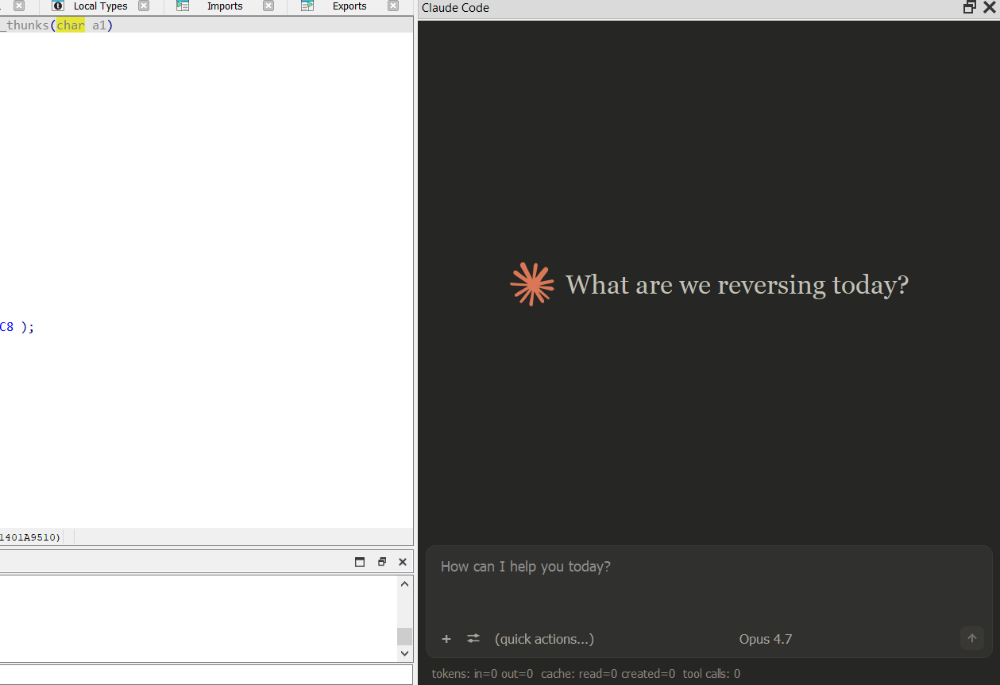

# Claude Code for IDA Pro

An IDA Pro plugin that embeds Claude as a dockable chat panel. Ask questions
about the current function, run an agent loop that drives the database
(list / read / rename / comment / jump), or fall back to a plain chat with
the logged-in `claude` CLI.



## Features

- **Dockable chat panel** pinned to IDA's right dock area (next to
  Functions / Imports), Ctrl+Shift+K to open.
- **Claude-style UI** — rounded dark input card with toolbar, coral send
  button, and a sliders menu.
- **Two auth modes**
  - *API key* — calls the Anthropic Messages API directly. Required for
    tool use.
  - *Claude CLI (account)* — shells out to the logged-in `claude` binary
    (same account as Claude Code in VS Code), no key required. Text-only.
- **IDA tools Claude can call** (API-key mode):
  - *read / navigate:* `read_function`, `list_functions`, `list_strings`,
    `list_imports`, `list_exports`, `list_globals`, `get_xrefs_to`,
    `get_xrefs_from`, `xrefs_to_field`, `read_bytes`, `get_int`,
    `get_string`, `get_global_value`, `read_struct`,
    `get_current_address`, `get_function_info`, `jump_to`,
    `int_convert`.
  - *edit:* `rename`, `add_comment`, `set_function_comment`,
    `set_function_prototype`, `patch_asm`, `declare_type`, `define_func`,
    `define_code`, `declare_stack`, `delete_stack`.
- **Selection-aware context** — if you highlight lines in the disasm or
  pseudocode view, Claude's reply focuses on that slice; otherwise the
  full current function is attached as before.
- **Auto-refresh after edits** — renames, retypes, comments and patches
  invalidate the Hex-Rays cache and repaint open disasm + pseudocode
  views, so you see changes without pressing F5.
- **Quick actions** — one-click prompts for explaining a function, renaming
  + commenting, vulnerability review, caller tracing, binary summary, or
  crypto hunting.
- **Allow edits** toggle — write tools are rejected unless the user opts
  in, so an agent run can't silently mutate the idb.
- **Dry run** — write tools return `(dry-run) would ...` instead of
  mutating the database, so you can preview an agent's plan.
- **Rate-limit aware** — a client-side sliding window caps input tokens
  per minute (30k default), and 429 responses are retried automatically
  using the server's `retry-after` header; the UI shows why it's paused
  instead of silently hanging.
- **Resilient history** — the conversation is sanitized on startup and
  after every turn, so cancelled tool calls never leave orphan `tool_use`
  blocks that would 400 the next request.
- **Model picker** — Opus 4.7, Opus 4.6, Sonnet 4.6, Haiku 4.5.

## Requirements

- IDA Pro 7.4+ with the bundled Python 3 and PyQt5 (standard IDA builds).
- Hex-Rays decompiler (optional; used only if "Include decomp" is checked).
- One of:
  - An Anthropic API key, or
  - The `claude` CLI on PATH, logged in via `claude /login`.

No third-party Python packages are needed — the client uses only the stdlib.

## Installation

1. Locate your IDA plugins directory.
   - Windows: `%APPDATA%\Hex-Rays\IDA Pro\plugins\`
   - macOS: `~/.idapro/plugins/`
   - Linux: `~/.idapro/plugins/`
2. Copy **both** of these into that folder:
   - `ida_claude.py`
   - the `ida_claude/` package directory
3. Copy `claude.png` and `chatclaude.png` next to `ida_claude.py` for the menu icon.
4. Restart IDA. You should see `[Claude] plugin loaded. Hotkey: Ctrl-Shift-K`
   in the output window.

### Authentication

Pick one:

**API key (recommended — enables tools)**
- Set `ANTHROPIC_API_KEY` in your environment before launching IDA, **or**
- Open the panel and click **API Key...** to paste it for the session
  (kept in memory only, not written to disk).

**Claude CLI (uses your logged-in account)**
- Install Claude Code: <https://docs.claude.com/claude-code>
- Run `claude /login` in a terminal and complete the browser sign-in.
- Verify `claude --version` works from a plain shell.
- In the panel, set **Auth** to **Claude CLI (account)**.

The panel auto-selects CLI mode if the binary is on PATH and no API key is
set.

## Usage

1. Open a binary in IDA.
2. Press **Ctrl+Shift+K** (or *View → Open subviews → Claude Code*, or
   *Windows → Claude Code*).
3. Put the cursor in a function you want to ask about. With **Auto-attach**
   on (default), the function is included with every message.
4. Type a question or pick a **quick action**. Ctrl+Enter to send.

### Panel controls

The input card's toolbar keeps only the essentials; everything else lives
behind the **sliders icon**  to the left of the attach button.

| Toolbar (always visible) | What it does                                         |
|--------------------------|------------------------------------------------------|
| `+` Attach func          | Attach a specific function by name to next message.  |
|  Settings slider             | Open the settings menu (all toggles below).          |
| Quick actions            | One-click prompts (explain, rename, bug review, ...).|
| Model                    | Which Claude model to use.                           |
| `✕` Cancel               | Cancel the in-flight turn (only shown while busy).   |
| `↑` Send                 | Submit (Ctrl+Enter).                                 |

| Settings menu        | What it does                                         |
|--------------------------|------------------------------------------------------|
| Auth → API key / CLI     | Choose between Anthropic API and the `claude` CLI.   |
| Set API key...           | Paste a key for this IDA session.                    |
| Use tools                | Let Claude call IDA tools in an agent loop.          |
| Allow edits              | Permit write tools (rename, comment, patch, ...).    |
| Include decomp           | Attach Hex-Rays pseudocode along with disassembly.   |
| Auto-attach context      | Attach current function / selection to each message. |
| Dry run                  | Write tools report `(dry-run) would ...` only.       |
| Show tool activity       | Render each `→ tool / ← result` inline (off = quiet).|
| Max tool calls           | Hard cap on agent loop steps per turn.               |
| Undo last batch          | Revert the edits made by the most recent turn.       |
| Clear conversation       | Wipe history and start over.                         |

### Tips

- **CLI mode is text-only.** IDA tools aren't invoked; Claude sees only the
  attached function text you send. Switch to API-key mode for agent runs.
- **Leave "Allow edits" off** during exploratory chats and flip it on when
  you explicitly want Claude to rename / comment.
- **Highlight a range** in the disasm or pseudocode view before asking a
  question to scope the answer to that slice. No highlight = full function.
- **Tool chatter is hidden by default.** Flip *Show tool activity* in the
  settings menu if you want to watch the agent's `→ tool / ← result` trace.
- Quoting an address like `0x401200` in Claude's reply is clickable via
  IDA's jump history — or ask Claude to `jump_to` it directly.

## Project layout

```
ida-pro-claude/
  ida_claude.py            # IDA plugin entry (PLUGIN_ENTRY, menu, dock)
  ida_claude/
    __init__.py
    chat_widget.py         # ClaudeChatForm: the Qt panel
    claude_client.py       # stdlib-only Anthropic Messages API client
    cli_client.py          # wrapper around the `claude` CLI binary
    ida_context.py         # pulls function context (disasm + decomp) from IDA
    ida_tools.py           # @tool-decorated IDA operations exposed to Claude
  claude.png               # menu icon
  chatclaude.png           # chat icon
```

## Troubleshooting

- **"No API key detected"** — set `ANTHROPIC_API_KEY` or click *API Key...*,
  or switch **Auth** to Claude CLI.
- **"`claude` CLI not found on PATH"** — install Claude Code and make sure
  its install dir is on PATH before launching IDA; run `claude /login`.
- **Tools greyed out** — you're in CLI mode. CLI runs its own agent loop and
  doesn't see our IDA-side tools. Switch to API key.
- **Panel disappears when clicking another tab** — it shouldn't; the plugin
  attaches to IDA's outer main window's right dock area rather than the
  central stacked widget. If it does, reopen via Ctrl+Shift+K.
- **Edits rejected** — enable **Allow edits** in the gear menu.
- **"Waiting Xs..." system lines** — the plugin is throttling to stay
  under the 30k input-tokens/min org limit, or the server returned a 429
  and we're honoring its `retry-after`. It resumes automatically.
- **Pseudocode didn't update after an edit** — should auto-refresh now.
  If a view is stale, press F5 to force a re-decompile.
- **If you dont see plugins directory in APPDATA create it and add the code**
